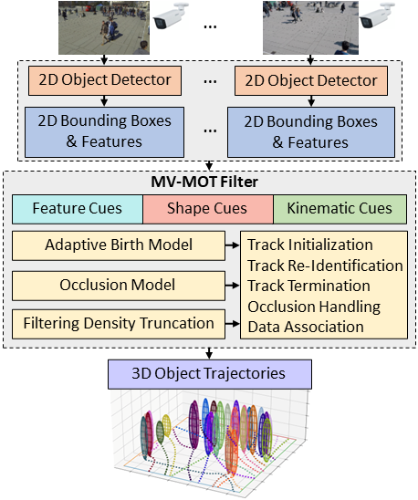

# MV-GLMB-AB (Multiview GLMB-Adaptive Birth)

This is the official Python and C++ implementation repository for a paper entitled "Track Initialization and Re-Identification for 3D Multi-View Multi-Object Tracking", *Information Fusion ([arXiv 2405.18606](http://arxiv.org/abs/2405.18606))*.




### Quick Overview
- Our method tracks 3D objects using only 2D detections from monocular cameras without needing detector retraining.
- Our approach maintains functionality despite camera reconfiguration by updating only the camera matrices for efficient online tracking.
- Integrating object re-identification features and kinematics into our measurement model allows us to perform track re-identification in 3D from 2D detections. 

### Usage
1. **Set Up Python Environment**
    - Create a `conda` Python environment and activate it:
        ```sh
        conda create --name virtualenv python==3.7.16
        conda activate virtualenv
        ```
    - Clone this repository recursively to have EigenRand and pybind11**
        ```sh
        git clone --recursive https://github.com/linh-gist/mv-glmb-ab.git
        ```

2. **Install Packages**
    - C++ Packages ([Make sure `Eigen 3.4.0` is installed](cpp_ms_glmb_ukf/README.md)): Navigate to the `cpp_ms_glmb_ukf` folder and run `python setup.py build develop`
    - Python Packages: `pip install -r requirements.txt` or using `conda install -c conda-forge motmetrics lap h5py matplotlib opencv`

3. **Configure Experiment Options**
    - Modify options such as `adaptive_birth=3, use_feat=True` to run experiments with Meanshift Adaptive Birth Methods and to toggle the use of re-identification features.
    - Set Default Occlusion Model: The default occlusion model is `detection_aka_occlusion_model_v2(...)`, but it can be changed to `detection_aka_occlusion_model(...)`.
    - In `demo.py` uses `glmb.runcpp(model_params, dataset, meas, adaptive_birth, use_feat)` to run experiments with C++. (Note: make sure to comment this line `glmb.run(model_params, dataset, meas)` 

4. **Prepare Data**
    - Datasets: 
        - CMC datasets (CMC1, CMC2, CMC3, CMC4, CMC5) can be download from [MEGA CLOUD, NZ](https://mega.nz/file/LKxAyZiT#wa-aMQmgk9guNkjj1olaPeUf-LgPS5P9iYBmZSLFnp8).
        - WILDTRACK dataset is available  [EPFL CVLAB](https://www.epfl.ch/labs/cvlab/data/data-wildtrack/).
    - Folder structure:
        ```
        |-- data
        |   |-- images
        |   |   |-- CMC1
        |   |   |   |-- Cam_1
        |   |   |   |-- Cam_2
        |   |   |   |-- Cam_3
        |   |   |   |-- Cam_4
        |   |   |-- ...
        |   |   |-- CMC5
        |   |   |-- WILDTRACK
        |-- source code
        |   |-- cpp_ms_glmb_ukf
        |   |-- detection
        |   |   |-- cstrack
        |   |   |   |-- CMC1
        |   |   |   |   |-- Cam_1.npz
        |   |   |   |   |-- Cam_2.npz
        |   |   |   |   |-- Cam_3.npz
        |   |   |   |   |-- Cam_4.npz
        |   |   |   |-- CMC2
        |   |   |-- fairmot
        |   |-- experiments
        |   |-- ms_glmb_ukf
        |-- README.md
        ```
    - Update the folders containing detection files, for example, `../detection/fairmot/` in `gen_meas.py`.
        - FairMOT 2D image detector (output bounding boxes and re-identification feature) https://github.com/ifzhang/FairMOT
        - CSTrack 2D image detector (output bounding boxes and re-identification feature) [https://github.com/JudasDie/SOTS](https://github.com/JudasDie/SOTS/blob/MOT/CSTrack/lib/tutorial/CSTrack/cstrack.md)
        - We can use pre-trained weights from FairMOT and CSTrack but to improve the accuracy of our 3D tracking algorithm on CMC and WILDTRACK datasets, 2D image detectors needs to be re-train on the CMC4 dataset (see [gen_labels_cmc.py](detection/fairmot/cmc/gen_labels_cmc.py)).
    - Update image files for visualization `../../data/images/` in `gen_meas.py`.
    - Prepare ground truth data `gt_data_dir="../../data/images/"` for performance evaluation using `CLEAR MOT` in `clearmot.py` and `OSPA2` in `ospa2.py`.
    - OSPA2 is re-implemented in Python and following this paper, an example code is given in `ospa2.py`.
        ```
        @article{rezatofighi2020trustworthy,
          title={How trustworthy are the existing performance evaluations for basic vision tasks?},
          author={Tran Thien Dat Nguyen and Hamid Rezatofighi and Ba-Ngu Vo and Ba-Tuong Vo and Silvio Savarese and Ian Reid},
          journal={IEEE Transactions on Pattern Analysis and Machine Intelligence},
          year={2022}
        }
        ```

5. **Run the Tracking Demo**
   - Navigate to the `ms_glmb_ukf` and run `python demo.py`
   
   


### Contact
Linh Ma (linh.mavan@gm.gist.ac.kr), Machine Learning & Vision Laboratory, GIST, South Korea

### Citation
If you find this project useful in your research, please consider citing by:

```
@article{linh2024inffus,
      title={Track Initialization and Re-Identification for {3D} Multi-View Multi-Object Tracking}, 
      author={Linh Van Ma, Tran Thien Dat Nguyen, Ba-Ngu Vo, Hyunsung Jang, Moongu Jeon},
      journal={Information Fusion},
      year={2024},
      publisher={Elsevier}
}
```

